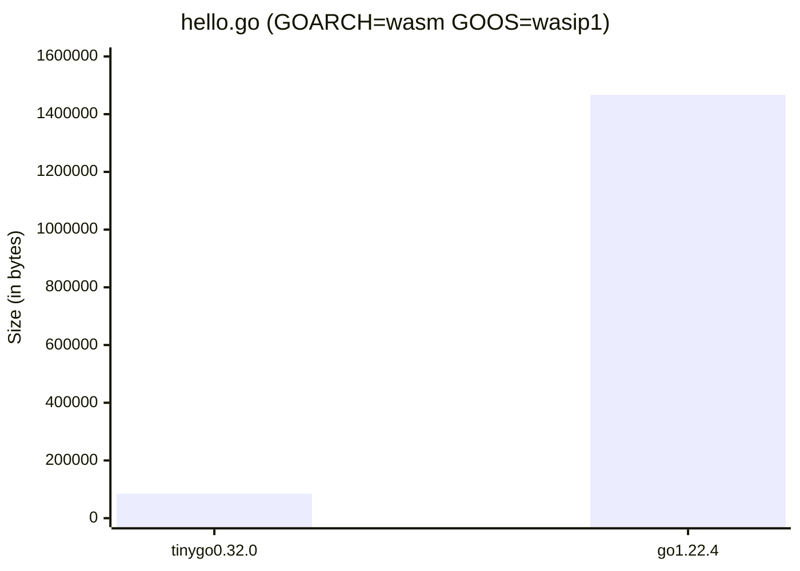
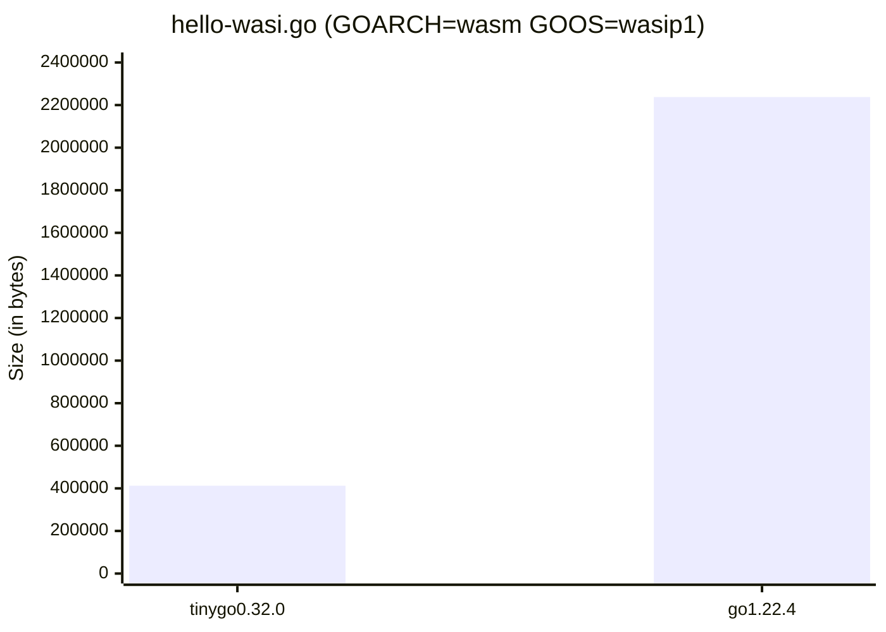

```mermaid
xychart-beta
    title "hello.go (GOARCH=wasm GOOS=wasip1)"
    x-axis [tinygo0.32.0, go1.22.4]
    y-axis "Size (in bytes)" 0 --> 1600000
    bar [84696, 1467672]
```

```mermaid
xychart-beta
    title "hello-wasi.go (GOARCH=wasm GOOS=wasip1)"
    x-axis [tinygo0.32.0, go1.22.4]
    y-axis "Size (in bytes)" 0 --> 2400000
    bar [412403, 2237624]
```
